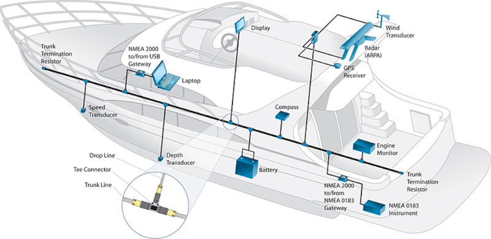

# CAN Bus

Install this app from the  *Settings* app and open it by clicking  `CAN Bus` under `Main -> OpenPlotter` or typing this in a terminal:

```console
openplotter-can
```


 ``Help`` opens an offline copy of this documentation in a browser and  ``Settings`` opens the main app.

To configure a NMEA 2000 converter that can connect via USB such as the *Actisense NGT-1* or the *OpenMarine CAN-USB Stick* (discontinued), see the chapter [Connecting a USB CAN converter data](../serial/connectingCAN.md).

If you want to configure a USB converter type ``slcand`` or based on the ``MCP2515`` chip, continue reading this section.

## Wiring

It does not matter what type of converter you have, USB or a Raspberry Pi HAT, all of them should have a L connector and a H connector. In most cases you simply have to connect the CAN_L cable of your NMEA 2000 CAN-BUS to the L connector of your converter and the CAN_H cable of your NMEA 2000 CAN-BUS to the H connector of your converter:


!!! note
	Some converters may also need to connect GND, see the documentation for your device.

!!! caution
	Do not connect the 12v power cable in any way.

At each end of the *Trunk Line* a *Termination Resistor* must be installed. Each termination resistor is 120 Ohms and is connected in parallel across the data pair of wires. This provides a total of 60 Ohms resitance across the network and is essential to data integrity. Most converters incorporate a 120 Ohms resistor to be optionally connected in case your NMEA 2000 CAN-BUS does not have a terminator. See the documentation for your device.

