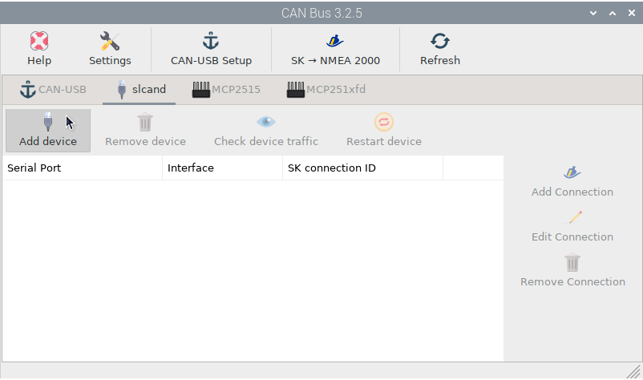
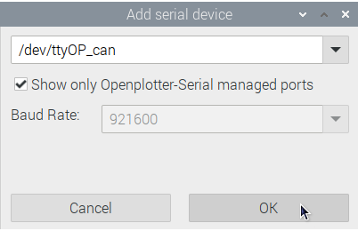
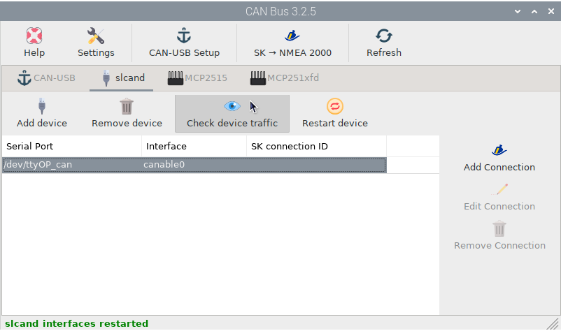
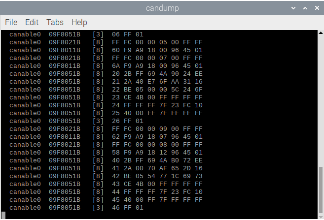
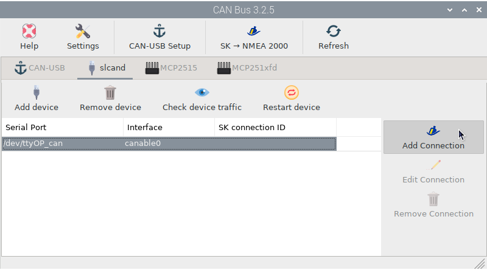
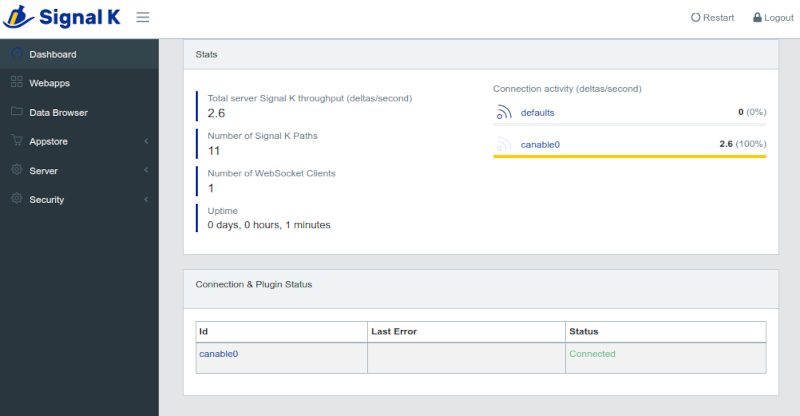

# Input data by slcand

This tutorial is for any NMEA 2000 converter that can connect via USB using *slcand* such as the devices available from [CANable](https://canable.io/).

First of all you have to define the device using the  *Serial* app. Then return to this  *CAN Bus* app and click  ``Add device`` in the   ``slcand`` tab:

Select the device you defined in the  *Serial* app and click ``OK``:

From this moment you should receive data on your device. Select the item from the list and click  ``Check device traffic`` to confirm data entry:

Now we need to get this data to the Signal K server. Select the connection from the list and click  ``Add Connection``. The Signal K server will restart and you are done:

Go to the Signal K server administration interface to confirm that the connection is now active:

Check OpenCPN to make sure there is a [connection to the Signal K server](../opencpn/skconnection.md) and you are getting data from your NMEA 2000 network.
