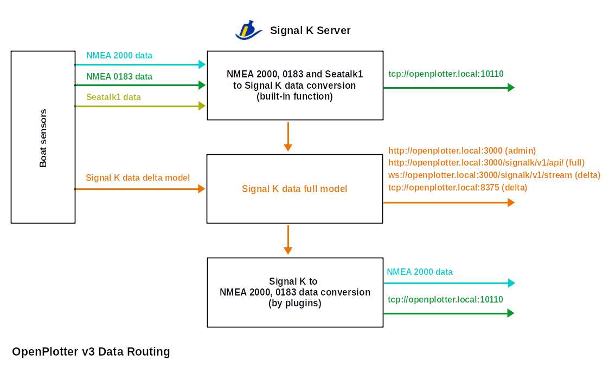
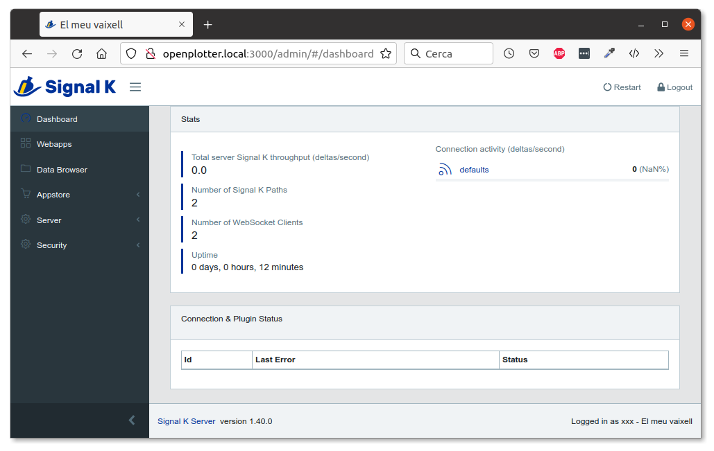

# How does it work?



The center of OpenPlotter is the **Signal K Server**. All the data collected by the boat's sensors in any of the supported formats are converted to Signal K format and stored. Once the server has the data in Signal K format, these can be sent by different ways to any program that supports this open source universal data exchange format or they can be converted again to any of the supported formats.

!!! note
	The main function of the different apps that make up OpenPlotter is to facilitate the connection of the sensors with the Signal K server and in some cases to directly generate data in Signal K format from the raw sensor data. There is also another group of apps dedicated to processing and displaying the data from the Signal K server. You will learn how to use these apps in successive chapters.

Depending on the initial format of the data, it can follow different routes or be available in different ways:

## Signal K

We encourage companies and developers to use the Signal K format for new sensors and devices. OpenPlotter can obtain Signal K data from sensors using USB, GPIO, UDP, TCP and Websockets connections.

There are two Signal K data models, *delta* and *full*. The delta format is used to exchange data between devices and/or servers and the full format is used to store data on servers. Read the [Signal K documentation](https://signalk.org/specification/1.7.0/doc/data_model.html) for details on both models.

When the Signal K server receives delta messages from sensors, it forwards them immediately through a Websocket and a TCP connection at:

```
ws://openplotter.local:3000/signalk/v1/stream
tcp://openplotter.local:8375
```

It also stores data using the full model. This data can be queried using the HTTP REST API at:

```
http://openplotter.local:3000/signalk/v1/api/
```

You can manage the Signal K server through a web application at:

```
http://openplotter.local:3000
```




!!! note
	You can learn more about Signal K here: [https://signalk.org/specification](https://signalk.org/specification)

## NMEA 0183

You can get NMEA 0183 data from USB, GPIO, TCP and UDP connections. The Signal K server will automatically convert the data to Signal K format and store it. NMEA 0183 data will also optionally be forwarded to:

```
tcp://openplotter.local:10110
```

!!! warning "Caution"
	If the same application gets NMEA 0183 data over the TCP port 10110 and also from any of the Signal K data outputs (HTTP, TCP, or WS) at the same time, it will probably get the same duplicate data in different formats.

If you have data in Signal K format that has not been converted from NMEA 0183, you can convert it to NMEA 0183 and send it through the TCP port 10110 using the **signalk-to-nmea0183** plugin.

!!! note
	To better understand the management of NMEA 0183 data in the Signal K server, please refer to the chapter [NMEA 0183 multiplexing](../signalk/multiplexing.md).

## NMEA 2000

You can get NMEA 2000 data from USB, GPIO, TCP and UDP connections. The Signal K server will automatically convert the data to Signal K format and store it.

If you have data in Signal K format that has not been converted from NMEA 2000, you can convert it to NMEA 2000 and send it through the same CAN bus adapter using the **signalk-to-nmea2000** plugin.

## Seatalk<sup>1</sup>

You can get data in the old Seatalk<sup>1</sup> format from a GPIO. The Signal K server will automatically convert the data to Signal K format and store it. There is currently no way to convert Signal K data to Seatalk<sup>1</sup> or send data in Seatalk<sup>1</sup> format from a Signal K server.
