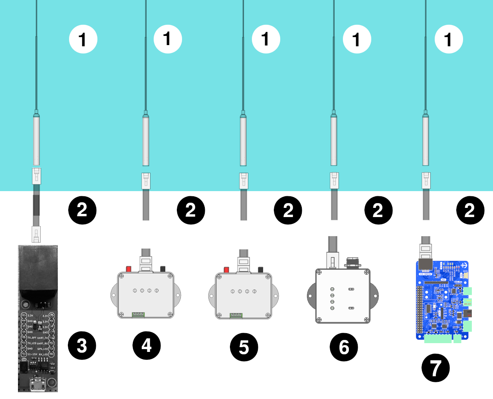
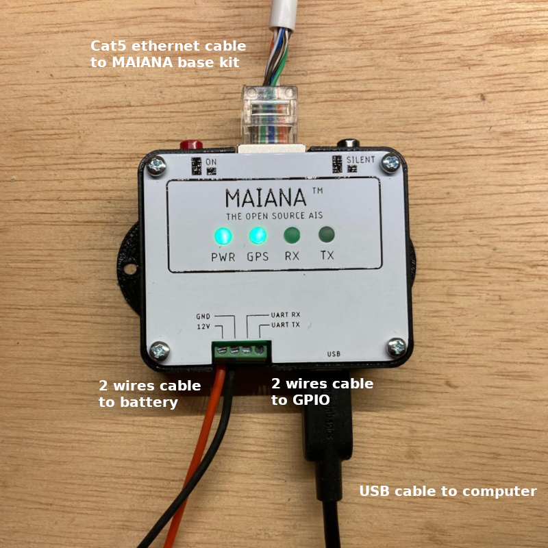
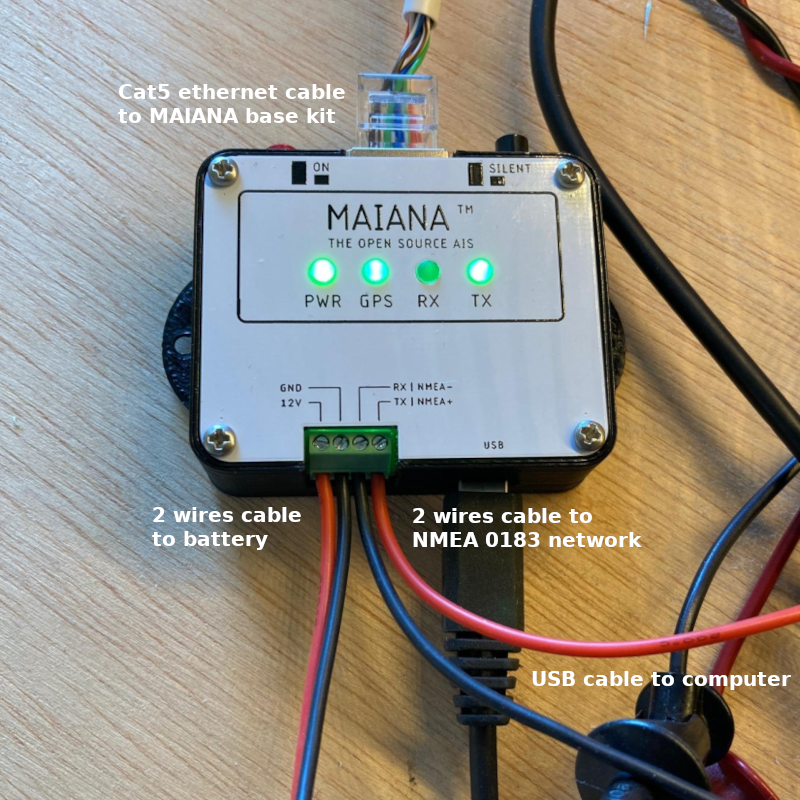
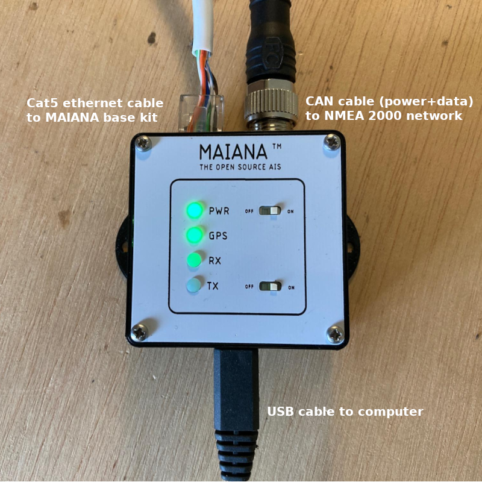
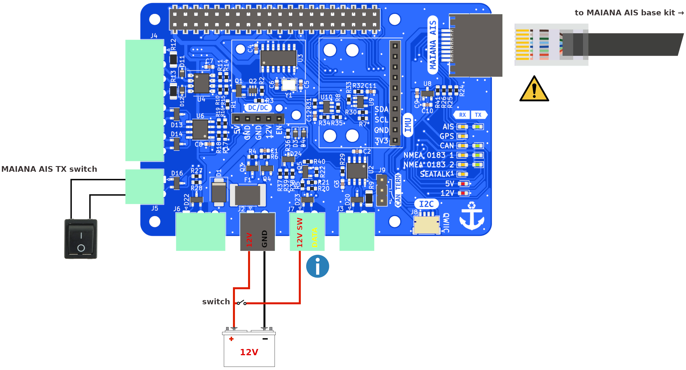

# Connecting the base kit

1. MAIANA base kit.
2. Cat5 cable (ethernet cable with RJ45 connectors). Not included with the MAIANA base kit.
3. Breakout board. Included with the MAIANA base kit.
4. USB + UART adapter. Not included with the MAIANA base kit.
5. USB + RS422 Adapter. Not included with the MAIANA base kit.
6. USB + CAN Adapter. Not included with the MAIANA base kit.
7. MacArthur HAT. Not included with the MAIANA base kit.

After the MAIANA base kit assembly process, you need to connect it to your boat via the Cat5 ethernet cable to power it, to get AIS/GNSS data and to configure the device. You have 5 options: the Breakout board, the USB+UART, USB+RS422 and USB+CAN adapters or the MacArthur HAT.

## Breakout board

This board is included with the base kit and it is designed so that you can incorporate MAIANA into your projects. Both USB and UART connections are used to get AIS/GNSS data, configure the device or update the firmware.

 

If you want a power and/or TX switch, you can use simple rocker switches. A 1A-rated SPST can simply interrupt the main 12V supply.

If you want a hardware switch for *silent mode*, you need to remember that transmission is disabled if the TX_OFF signal is driven to a logic *high* (above 2V), so wire it as shown in the picture.

The LED signals are open drain outputs. Rather than supplying a voltage, they pull the cathode of the
LED to GND via a built-in 100 Ohm resistor. The voltage you apply to the anode is flexible (up to 30V tolerated), but the breakout supplies 3.3V so take advantage! That said, some LEDs may still draw too much current and will need an extra resistor added in series. You can wire that on either the anode or the cathode side.

## USB + UART adapter

Both USB and UART connections are used to get AIS/GNSS data, configure the device or update the firmware. This adapter has the same functions as the included *breakout board* but incorporates status LEDs, switches and is soldered and assembled.

## USB + RS422 Adapter

USB connection is used to get AIS/GNSS data, configure the device or update the firmware. RS422 connection is used only to send AIS/GNSS data to the NMEA 0183 network of your boat. This adapter incorporates status LEDs, switches and is soldered and assembled.

## USB + CAN Adapter

USB connection is used to get AIS/GNSS data, configure the device or update the firmware. CAN connection is used only to send AIS/GNSS data to the NMEA 2000 network of your boat and power the device. This adapter incorporates status LEDs, switches and is soldered and assembled.

## MacArthur HAT

This HAT has the same features as all MAIANA AIS adapters together. You can receive AIS and GNSS data and configure the MAIANA transponder in OpenPlotter through the UART0 interface. You can also send NMEA
0183, NMEA 2000 or Signal K data to any device on your boat.

Read the "MAIANA AIS" chapter of the [MacArthur HAT manual](https://macarthur-hat-documentation.readthedocs.io/en/latest/maiana.html) to see all connection options.