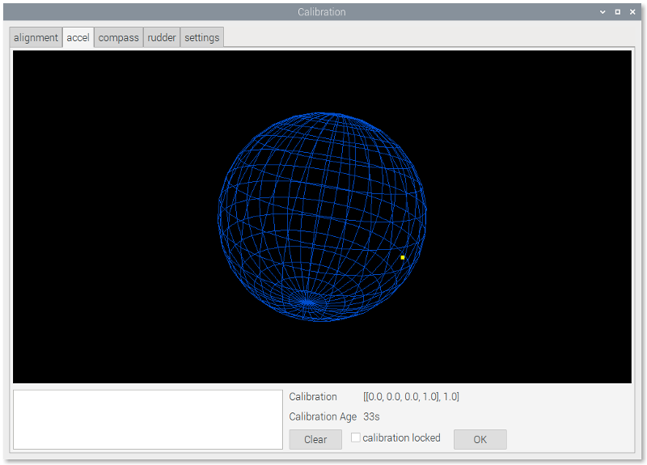
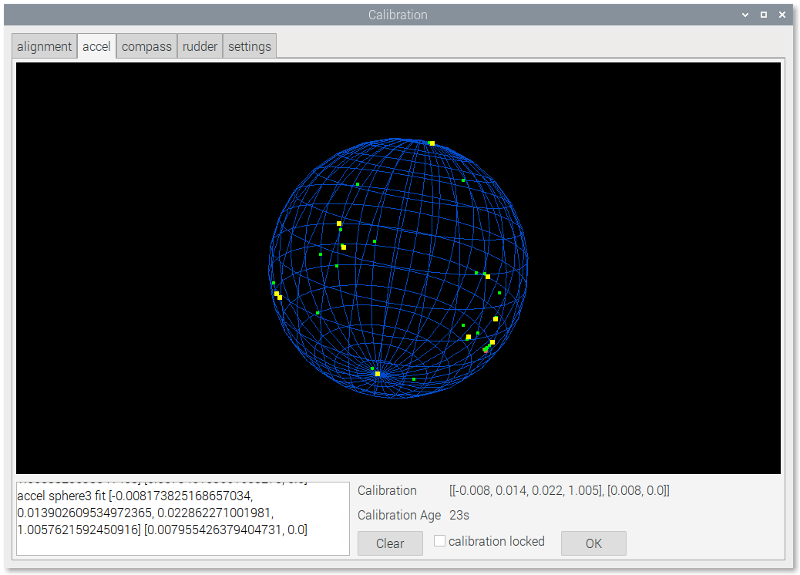
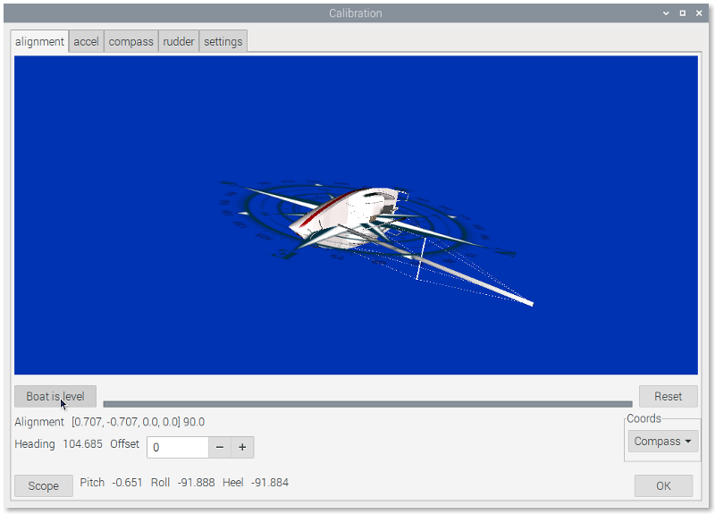
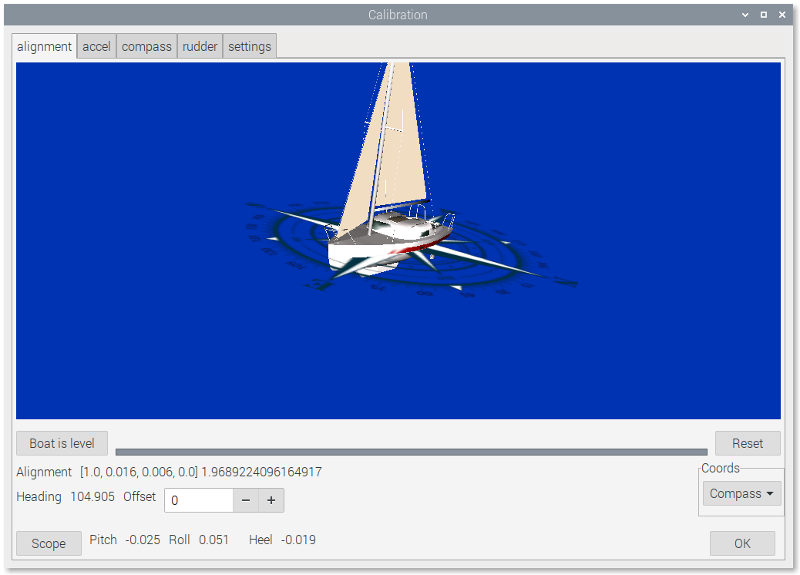
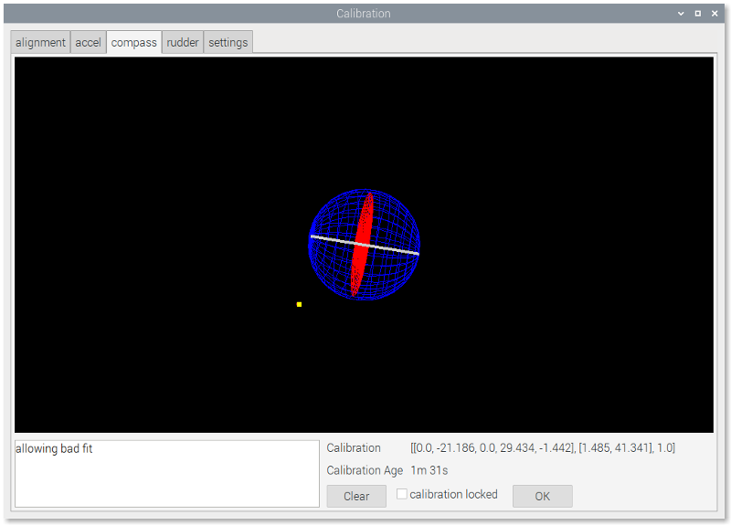
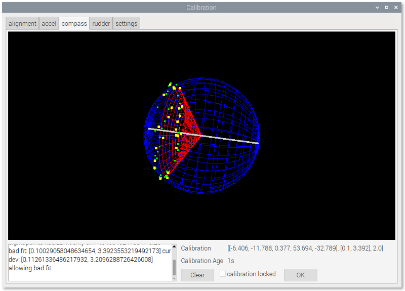

# Compass calibration

Follow these steps in order:

## 1. Accelerometer bias

IMUs require accelerometer bias calibration. Without it, there will be significant pitch and roll errors. Most of them are factory calibrated, which means you could skip this step, but it is recommended to calibrate the accelerometer bias, even if it is factory calibrated, as it will slightly improve the factory calibration.

To calibrate the accelerometer bias, you must be on a *mostly* stable platform. It may be impossible to do at anchor if the boat is moving too much, so either in flat water, or land for this step.

Go to  *Pypilot* app and click on  ``Calibration``. In Calibration window click on ``accel`` tab. Make sure *calibration locked* is not enabled.

Carefully place the sensor on each of the 6 sides of a box (+- 10 degrees will do) the actual orientation is not critical, so long as enough measurements can be taken to fit a sphere. Leave the sensors in each position for a few seconds.

Once a calibration is applied the accelerometer *Calibration Age* should reset and fit points become yellow. If it does not, repeat the process putting the sensors in different orientations until a calibration fix is found.

If you use the cheapest sensors, sometimes they have bad accelerometers. Either one axis will always read zero, or they will saturate because the bias is greater than 1g. This is easy to determine from the accelerometer calibration plot in calibration window. 

## 2. Alignment

Once the accelerometer is calibrated, the sensor should be fixed securely to the boat. Alignment and compass calibration are required for correct operation. If sensors are moved or remounted, this must be performed again (but not accelerometer calibration).

To perform alignment, ensure the boat is level (not heeling or pitching) and in relatively calm water (small waves motion of a few degrees is ok). Go to ``alignment`` tab and click  ``Boat is level`` button.

Correct alignment must be performed before the compass calibration can begin. 

## 3. Compass

Be sure to locate the sensors away from:

- magnets - speakers and especially moving magnets like floating compasses.
- current carrying wires - very simple rule is 2 cm (1 inch) for every amp.
- iron and steel - less critical. If you are in a steel boat, just do not fix the sensors to a steel wall and try to locate them several inches at least offset from it.

The compass calibration is mostly automatic. If the accelerometer and alignment are calibrated, you just need to sail turning more than 180 degrees to calibrate the compass.

Go to ``compass`` tab and make sure *calibration locked* is not enabled or updates will not occur.

There are both 2D and 3D compass calibration fixes. A 2D fix will occur from turning without pitching or heeling. When heeling there may be some error without a 3D fix. To obtain a 3D fix, you should make a circle with sufficient heeling, such as tacking against the wind, or rolling in waves.

Subsequent 2D fixes will use the previous undetermined value for 3D fix, combining the new 2D fix with the past information from a 3D fix. Performing accelerometer calibration will give a rough 3D fix in most cases making a subsequent 2D fix sufficient for most use.

Compass calibration is continuous and always updates unless locked. You may want to lock it to prevent future calibration updates when you know there is compass interference, but unlocking it is recommended.

Once a new calibration is applied, the accelerometer *Calibration Age* should reset and fit points become yellow.

If the sensors are remounted, they must be re-aligned and the compass recalibrated.

If metal objects are moved around the sensors, the compass must recalibrate. 

## 4. Heading Offset

Once the compass is calibrated a heading offset can be entered in ``alignment`` tab depending on the orientation that the sensors are mounted in the boat. Without this, the pilot can still hold a course, but the heading displayed will not match the actual course. This corrects this offset as well as ensures the pitch and roll readings are correct. For example if the heading offset is off by 90 degrees, the pitch and roll readings may be reversed.