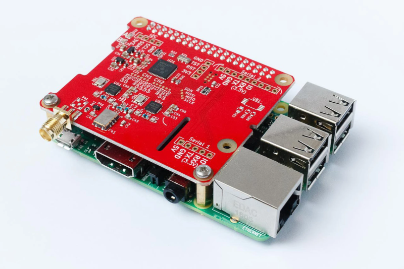
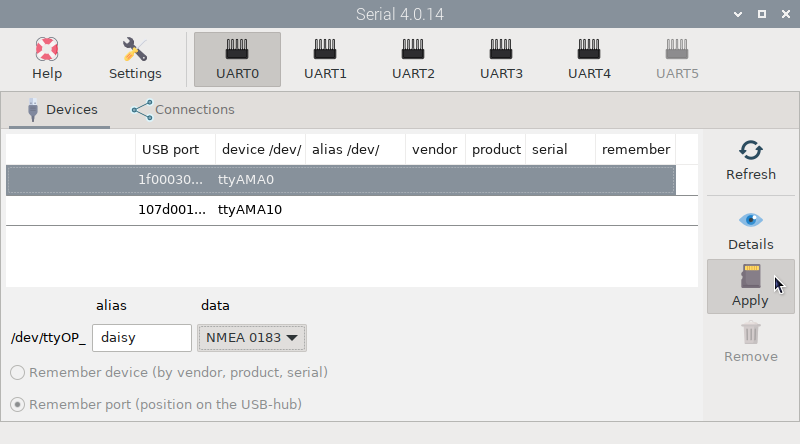
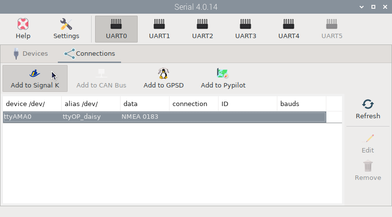
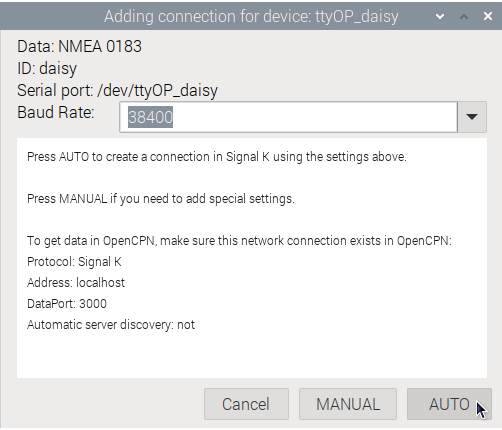

# Connecting the dAISy HAT

**Specification**

* True two channel receiver, continuously receiving on AIS channels A (161.975 MHz) and B (162.025 MHz)
* Superior sensitivity compared to other low-cost AIS receivers
* Low power, less than 200mW in receive mode (<40mA at 5V)
* 38400 baud serial output in industry standard NMEA format (AIVDM)
* Communicates with Raspberry Pi via UART0.
* Works with Raspberry Pi 1 (A+/B+ only), Pi 2, Pi 3, Pi 4, Pi 5 and Pi Zero
* Shape and size compliant with Raspberry Pi HAT standard
* Breakout pads for 2 independent TTL serial outputs, 3.3 and 5 volt rails, and Raspberry Pi I2C port
* SMA antenna connector
* SMA-to-BNC adapter and hex standoffs included

!!! note
	This product is available in the [OpenMarine Shop](http://shop.openmarine.net/). Buying at OpenMarine Shop helps us keep the project alive. On the [original product page](https://shop.wegmatt.com/products/daisy-hat-ais-receiver) you will find the full specification and a better choice for US buyers.

**Configuration**

Mount the dAISy HAT in your Raspberry Pi and enable a serial port in the GPIO header of the Raspberry Pi by clicking the  ``UART0`` icon:

Acknowledge the warning, and reboot the Raspberry Pi:

  
*Raspberry Pi model 3 and 4*

  
*Raspberry Pi model 5*

After the reboot, launch the  *Serial* app again. On the  ``Devices`` tab, you should now see a new entry. Select the line with *ttyAMA0*, give it an alias (for example `daisy`) and select `NMEA 0183` from the data dropdown, then press  ``Apply``:

Now we need to connect the *ttyOP_daisy* device to the Signal K server, the central data processing hub of OpenPlotter. Switch to the  ``Connections`` tab, select the *ttyOP_daisy* device and click  ``Add to Signal K``:

From the *Baud Rate* dropdown menu select `38400`, then press ``AUTO``:

You are done, the Signal K server and any program connected to it, such as OpenCPN, should now receive AIS data. Check OpenCPN to make sure there is a [connection to the Signal K server](../opencpn/skconnection.md) and it is getting data from your DAISy HAT:

