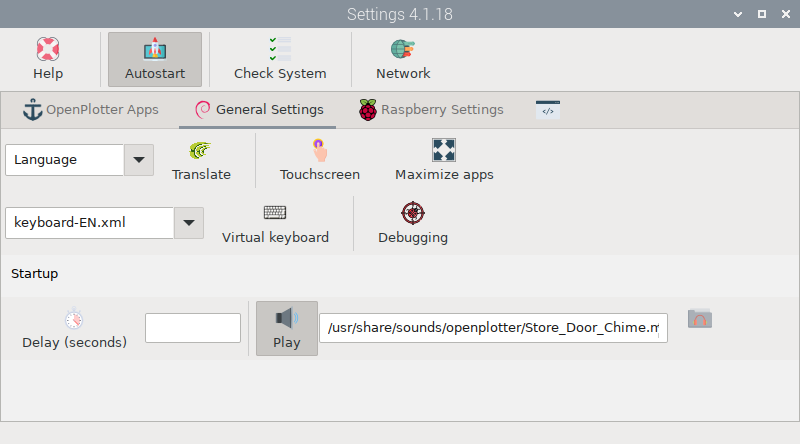
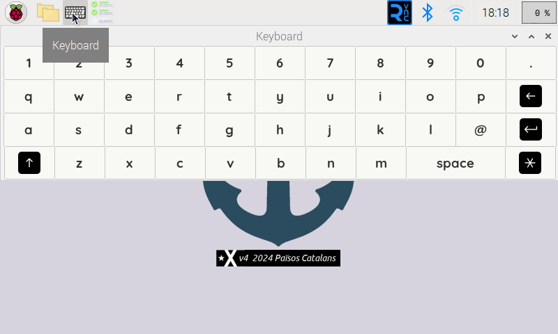

#  General Settings

##  Language

You can select any of the available languages and all OpenPlotter apps will be translated the next time you open them. You can help us with translations by clicking ``Translate``.

##  Touchscreen

After enabling this setting, most programs will display monster scrolls better for sailors' fingers and some programs like OpenCPN will be optimized for touchscreens.

##  Maximize

If you enable this option, all OpenPlotter applications will be maximized the next time you open them.

##  Virtual keyboard

OpenPlotter includes a virtual keyboard for touch systems or systems that do not have a physical keyboard. You can customize your virtual keyboard by creating a layout that suits your requirements and your language.

!!! note
	Visit this [link](https://forum.openmarine.net/showthread.php?tid=4070) to know how to create and share a custom keyboard layout.

##  Debugging

When this button is enabled, OpenPlotter apps will generate error messages that will be saved to the log file or printed on the screen when the application is run from a terminal. Use this feature only to check for errors, do not forget to disable it later because it might slow down performance or lead to oversized log files.

##  Delay

Sometimes you may need some devices or programs to be ready before they work normally. Adding seconds to this field and enabling this button will add a delay to the OpenPlotter startup process to allow time for these lazy devices or programs.

##  Play
*************

You can play a sound to notify you when the OpenPlotter startup process is complete. Select a sound by clicking  and enable the  ``Play`` button. This is especially useful for headless systems.
