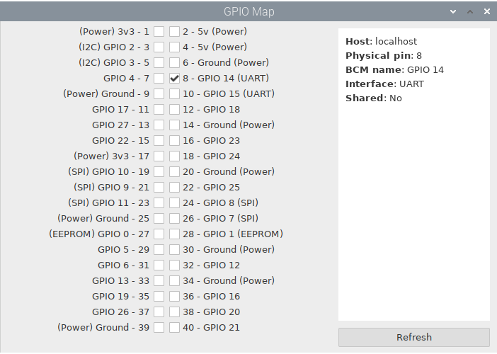

#  Raspberry Settings

##  GPIO Map

Some apps will report which GPIO they are using and you can check it here. Checking a GPIO will return useful information about its usage.

##  Install backlight

Brightness on monitors that are connected via the DSI display port can be controlled by software. If you have a DSI touchscreen as the [official monitor for Raspberry Pi](https://www.raspberrypi.com/products/raspberry-pi-touch-display) or any of its clones, you can install the necessary software to control brightness by clicking  ``Install backlight`` button.

##  Set backlight

After installing the required software, you will have access to a graphical interface to set the brightness using a slider.

If you have the  *Notifications* app installed, you will see a new action added to the list to automatically set the backlight value upon receiving a specific notification:

##  Wayland

The latest version of *Raspberry OS* contains the Wayland graphical server by default, but some programs and system tools still do not work correctly in this graphical environment. OpenPlotter still uses the old X11 graphic environment by default to ensure that all programs work correctly until Wayland is mature enough.

You can switch between graphical environments by clicking the  `Wayland` button.

##  Hotspot+Client

To turn the Raspberry Pi internal WiFi device into an access point and a client simultaneously, just click on  `Hotspot+Client`.

!!! note
	Go to the [Network](../network/network_app.md) chapter to learn how to connect OpenPlotter to the Internet and how network management has changed since the last version.

##  Shutdown

You can use any GPIO on the Raspberry to set a shutdown botton. Click  ``GPIO`` to choose a GPIO, usually GPIO 21 at pin 40. Select a GPIO ``Transition`` to trigger the shutdown, *high->low* or *low->high*. Select an internal pull resistor, *pull-up* and *pull-down*, or *off* if you use an external pull resistor. Click  ``Apply`` to save settings and changes will be applied after the next reboot.

##  Power off

You can use any GPIO on the Raspberry to notify an external circuit that it can safely cut power. Click  ``GPIO`` to choose a GPIO, usually GPIO 26 at pin 37. Select a GPIO ``Transition`` to trigger the power off, *high->low* or *low->high*. Click  ``Apply`` to save settings and changes will be applied after the next reboot.
