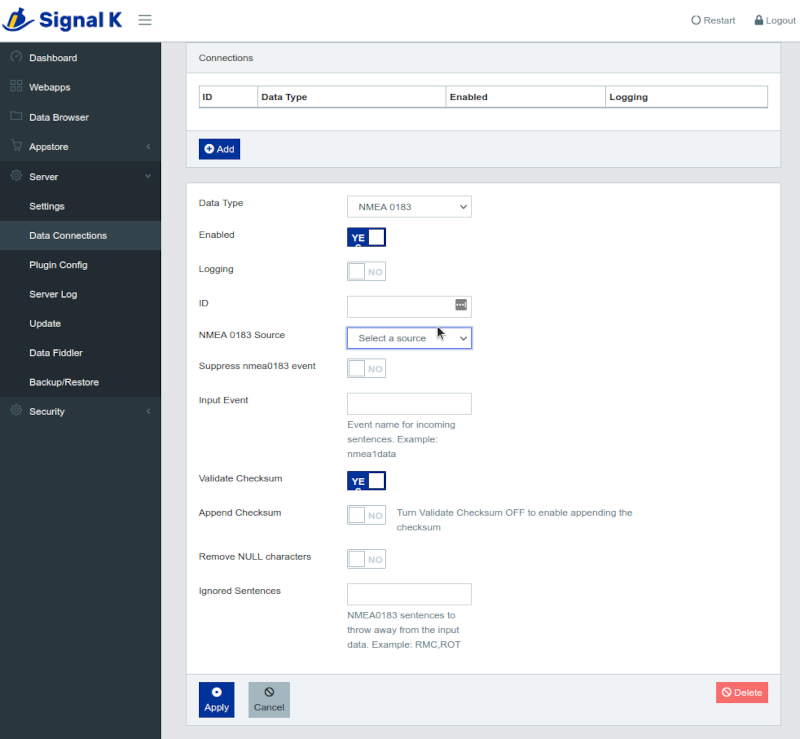
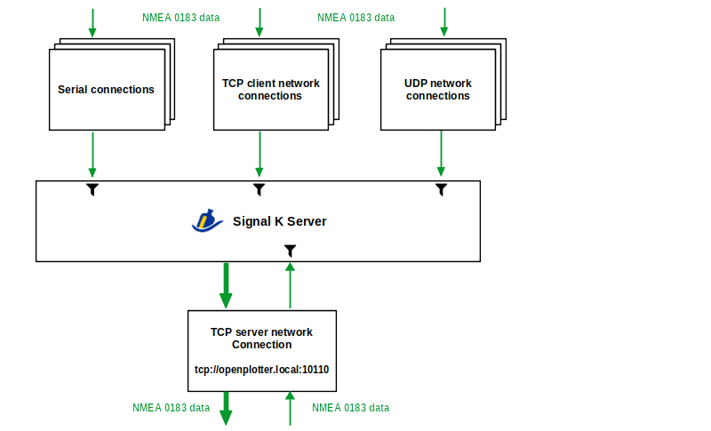
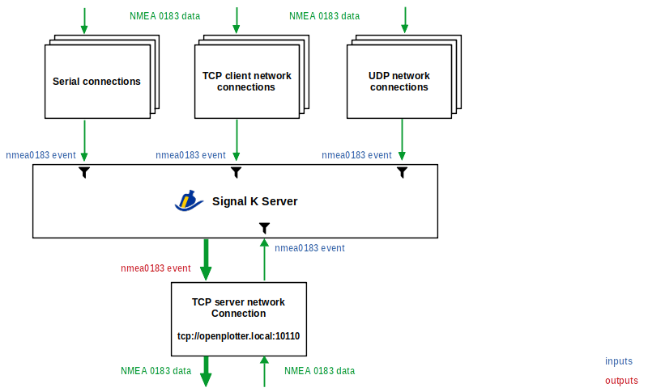
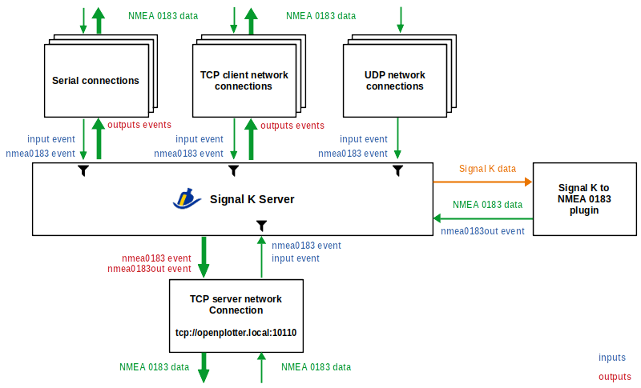

# NMEA 0183 multiplexing

The Signal K server is a powerful NMEA 0183 multiplexer. It can merge all the NMEA 0183 devices on your boat into a single channel, add new data to this channel, redistribute data between devices, filter out unwanted data and even correct malformed data. As always, powerful tools can be a bit difficult to understand at first but here we will try to make it easier.

Using the Signal K server administrator you can set connections to get NMEA 0183 data through *Serial*, *TCP Client*, *TCP Server on port 10110* and *UDP*. There is another option called *GPSD* that works as a TCP client and that you will only use when you want to use that tool to control your GPS/AIS receiver. To add NMEA 0183 connections go to *Server --> Data Connections*, click ``Add``, select ``NMEA 0183`` in *Data Type* and choose an option in *NMEA 0183 source*:

By default, the Signal K server always creates a TCP server on port 10110. **This TCP server on port 10110 will be the default output of all multiplexed input data**. If you create a new data connection by selecting ``TCP Server on port 10110`` in the *NMEA 0183 source* field, what you are actually doing is also enabling data input to this TCP server on port 10110. 

You can also filter  unwanted NMEA 0183 sentences in each input by entering them in the field *Ignored Sentences*:

And now comes the most interesting. The Signal K server uses a mechanism called **Events** to internally tag data that comes from connections. When you create an NMEA 0183 connection, by default the data is assigned to the **nmea0183** event, this way the TCP server in port 10110 knows that any data tagged with *nmea0183* should be sent out to clients. If you want the data of any of the connections not to be sent to the output you just have to check ``Suppress nmea0183 event`` in the settings of that connection:

In addition to multiplexing data from different NMEA 0183 inputs, the Signal K server also converts the NMEA 0183 data to Signal K format and can also receive data in NMEA 2000 or Seatalk1 format from other inputs which will also be converted to Signal K format. If you want to convert some data to NMEA 0183 because its original format was not NMEA 0183 and you want to have it in the output as well, you should use the *Signal K to NMEA 0183* plugin.

This plugin automatically adds the **nmea0183out** event to the converted data and since the TCP server on port 10110 also listens to this event, it will also send this data to the output. Using two event names here allows distinguishing between original and derived/generated data:

We have seen how the server uses some predefined system events to collect or discriminate NMEA 0183 data from several sources and send them merged by a single output. We will see now how using custom events we can create more than one output or share data between connections.

When creating NMEA 0183 connections, you will see an option called *Input Event*. That means you can configure an extra event to tag the input data in addition to the default *nmea0183* event.

When creating *Serial* or *TCP Client* connections, you will see an additional option called *Output Events*. That means that all data tagged with those events will be sent out the output of that device or network connection. 

UDP connections are inbound only. The *Output Events* of the TCP server on port 10110 are *nmea0183* and *nmea0183out* and cannot be changed:

!!! note
	More information about event handling can be found on the Signal K server [github page](https://github.com/SignalK/signalk-server/wiki/Events-and-Outputting-Data).